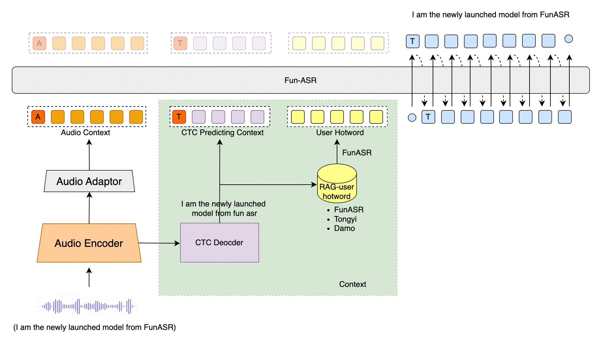
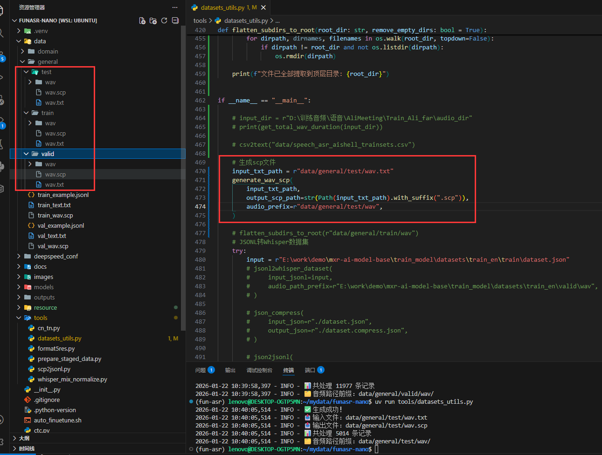
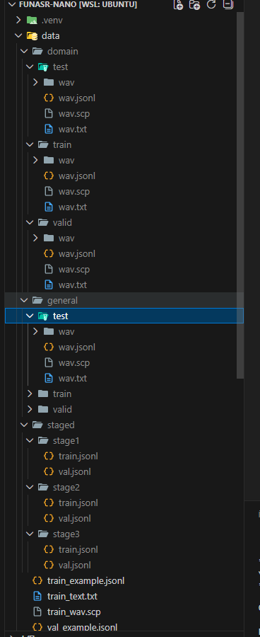
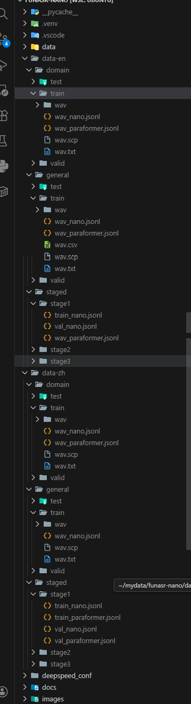
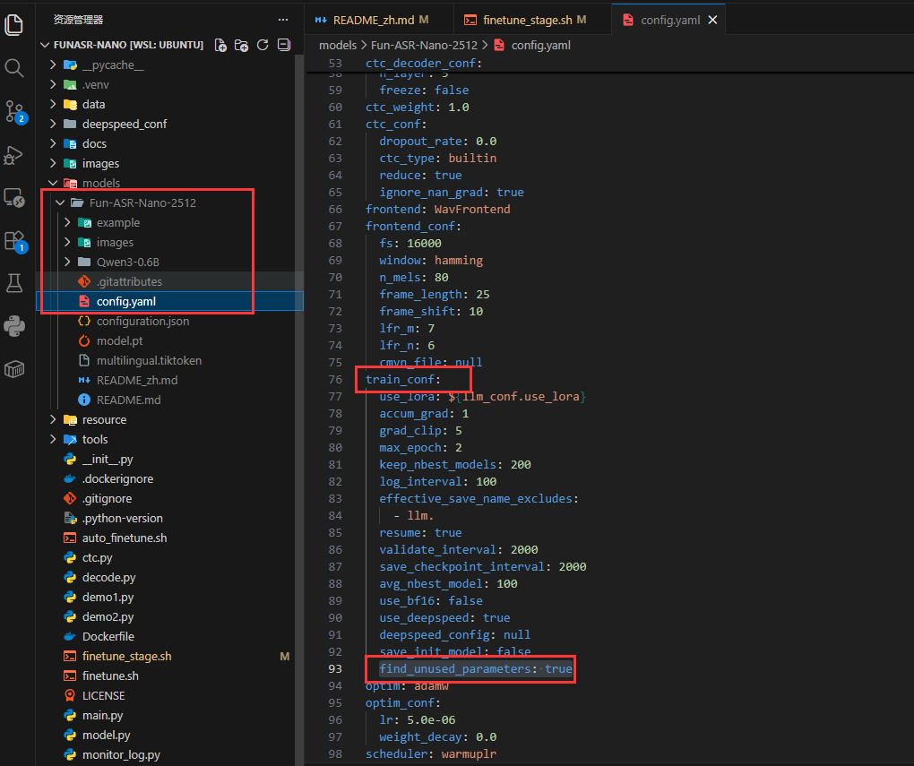
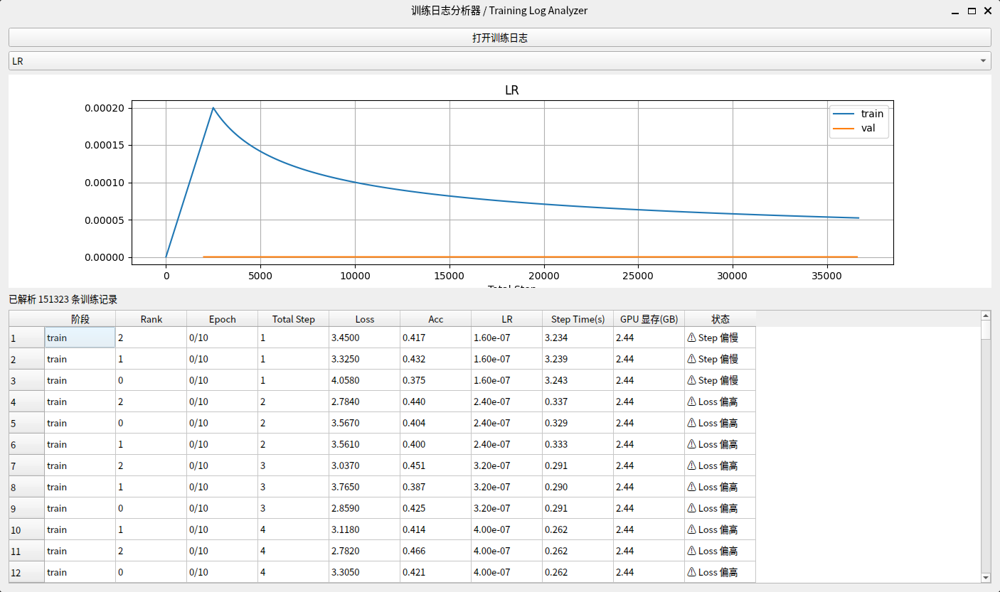
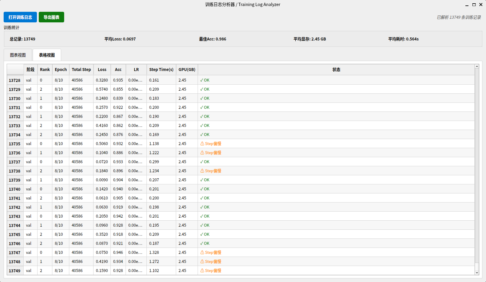

# Fun-ASR

[TOC]

「简体中文」|「[English](README.md)」

Fun-ASR 是通义实验室推出的端到端语音识别大模型，是基于数千万小时真实语音数据训练而成，具备强大的上下文理解能力与行业适应性，支持低延迟实时听写，并且覆盖 31 个语种。在教育、金融等垂直领域表现出色，能准确识别专业术语与行业表达，有效应对"幻觉"生成和语种混淆等挑战，实现"听得清、懂其意、写得准"。

# 项目启动说明

torch and cuda: https://pytorch.org/get-started/previous-versions/
flash-attn PyTorch Compatibility：https://flashattn.dev/compatibility/pytorch
```bash
uv sync --extra cu128
uv pip install transformers==4.57.6 peft funasr==1.3.1 deepspeed
# 训练qwen3-asr 需要额外安装以下插件
uv pip install datasets qwen_asr
# export MAX_JOBS=2
# uv pip install -U flash-attn==2.8.3 --no-build-isolation
uv pip install https://github.com/Dao-AILab/flash-attention/releases/download/v2.8.3/flash_attn-2.8.3+cu12torch2.8cxx11abiTRUE-cp311-cp311-linux_x86_64.whl
```

<div align="center">

</div>

<div align="center">
<h4>
<a href="https://funaudiollm.github.io/funasr"> Homepage </a>
｜<a href="#核心特性"> 核心特性 </a>
｜<a href="#性能评测"> 性能评测 </a>
｜<a href="#环境安装"> 环境安装 </a>
｜<a href="#用法教程"> 用法教程 </a>

</h4>

模型仓库：[modelscope](https://www.modelscope.cn/models/FunAudioLLM/Fun-ASR-Nano-2512)，[huggingface](https://huggingface.co/FunAudioLLM/Fun-ASR-Nano-2512)

在线体验：
[魔搭社区创空间](https://modelscope.cn/studios/FunAudioLLM/Fun-ASR-Nano)，[huggingface space](https://huggingface.co/spaces/FunAudioLLM/Fun-ASR-Nano)

</div>

|                                                                              模型                                                                               |                                                                                                                                                    介绍                                                                                                                                                    |  训练数据  | 参数 |
| :-------------------------------------------------------------------------------------------------------------------------------------------------------------: | :--------------------------------------------------------------------------------------------------------------------------------------------------------------------------------------------------------------------------------------------------------------------------------------------------------: | :--------: | :--: |
|       Fun-ASR-Nano <br> ([⭐](https://www.modelscope.cn/models/FunAudioLLM/Fun-ASR-Nano-2512) [🤗](https://huggingface.co/FunAudioLLM/Fun-ASR-Nano-2512))       |         支持中文、英文、日文。中文包含 7 种方言（吴语、粤语、闽语、客家话、赣语、湘语、晋语）及 26 种地域口音支持（河南、陕西、湖北、四川、重庆、云南、贵州、广东、广西、河北、天津、山东、安徽、南京、江苏、杭州、甘肃、宁夏）。英文、日文涵盖多种地域口音。额外功能包括歌词识别与说唱语音识别。          | 数千万小时 | 8 亿 |
| Fun-ASR-MLT-Nano <br> ([⭐](https://www.modelscope.cn/models/FunAudioLLM/Fun-ASR-MLT-Nano-2512) [🤗](https://huggingface.co/FunAudioLLM/Fun-ASR-MLT-Nano-2512)) | 支持中文、英文、粤语、日文、韩文、越南语、印尼语、泰语、马来语、菲律宾语、阿拉伯语、印地语、保加利亚语、克罗地亚语、捷克语、丹麦语、荷兰语、爱沙尼亚语、芬兰语、希腊语、匈牙利语、爱尔兰语、拉脱维亚语、立陶宛语、马耳他语、波兰语、葡萄牙语、罗马尼亚语、斯洛伐克语、斯洛文尼亚语、瑞典语，共 31 种语言。 | 数十万小时 | 8 亿 |

<a name="最新动态"></a>

# 最新动态 🔥

- 2025/12: [Fun-ASR-Nano-2512](https://modelscope.cn/models/FunAudioLLM/Fun-ASR-Nano-2512) 是一款基于数千万小时真实语音数据训练的端到端语音识别大模型。它支持低延迟实时转写，并涵盖 31 种语言识别功能。
- 2024/7: [FunASR](https://github.com/modelscope/FunASR) 是一款功能全面的语音识别基础工具包，集成了多项核心功能，包括自动语音识别（ASR）、语音活动检测（VAD）、标点恢复、语言模型、说话人验证、说话人日志记录以及多说话人语音识别。

# 核心特性 🎯

**Fun-ASR** 专注于高精度语音识别、多语言支持和行业定制化能力

- **远场高噪声识别：** 针对远距离拾音及高噪声场景（如会议室、车载环境、工业现场等）进行深度优化，识别准确率提升至 **93%**。
- **中文方言与地方口音：**
  - 支持 **7 大方言**：吴语、粤语、闽语、客家话、赣语、湘语、晋语
  - 覆盖 **26 个地区口音**：包括河南、陕西、湖北、四川、重庆、云南、贵州、广东、广西等 20 多个地区
- **多语言自由说：** 支持 **31 种语言**识别，重点优化东亚与东南亚语种，支持语种自由切换和混合识别。
- **音乐背景歌词识别：** 强化在音乐背景干扰下的语音识别性能，支持对歌曲中歌词内容的精准识别。

# 环境安装 🐍

```shell
git clone https://github.com/FunAudioLLM/Fun-ASR.git
cd Fun-ASR
uv sync
```

<a name="用法教程"></a>

# TODO

- [x] 支持返回时间戳
- [ ] 支持区分说话人识别
- [x] 支持模型训练

# 用法 🛠️

## 推理

### 使用 funasr 推理

```python
from funasr import AutoModel


def main():
    model_dir = "FunAudioLLM/Fun-ASR-Nano-2512"
    model = AutoModel(
        model=model_dir,
        trust_remote_code=True,
        remote_code="./model.py",
        device="cuda:0",
        hub="ms"
    )

    wav_path = f"{model.model_path}/example/zh.mp3"
    res = model.generate(
        input=[wav_path],
        cache={},
        batch_size=1,
        hotwords=["开放时间"],
        # 中文、英文、日文 for Fun-ASR-Nano-2512
        # 中文、英文、粤语、日文、韩文、越南语、印尼语、泰语、马来语、菲律宾语、阿拉伯语、
        # 印地语、保加利亚语、克罗地亚语、捷克语、丹麦语、荷兰语、爱沙尼亚语、芬兰语、希腊语、
        # 匈牙利语、爱尔兰语、拉脱维亚语、立陶宛语、马耳他语、波兰语、葡萄牙语、罗马尼亚语、
        # 斯洛伐克语、斯洛文尼亚语、瑞典语 for Fun-ASR-MLT-Nano-2512
        language="中文",
        itn=True, # or False
    )
    text = res[0]["text"]
    print(text)

    model = AutoModel(
        model=model_dir,
        trust_remote_code=True,
        vad_model="fsmn-vad",
        vad_kwargs={"max_single_segment_time": 30000},
        remote_code="./model.py",
        device="cuda:0",
    )
    res = model.generate(input=[wav_path], cache={}, batch_size=1)
    text = res[0]["text"]
    print(text)


if __name__ == "__main__":
    main()
```

### 直接推理

```python
from model import FunASRNano


def main():
    model_dir = "FunAudioLLM/Fun-ASR-Nano-2512"
    m, kwargs = FunASRNano.from_pretrained(model=model_dir, device="cuda:0")
    m.eval()

    wav_path = f"{kwargs['model_path']}/example/zh.mp3"
    res = m.inference(data_in=[wav_path], **kwargs)
    text = res[0][0]["text"]
    print(text)


if __name__ == "__main__":
    main()
```

<details><summary> 参数说明（点击展开）</summary>

- `model_dir`：模型名称，或本地磁盘中的模型路径。
- `trust_remote_code`：是否信任远程代码，用于加载自定义模型实现。
- `remote_code`：指定模型具体代码的位置（例如，当前目录下的 `model.py`），支持绝对路径与相对路径。
- `device`：指定使用的设备，如 "cuda:0" 或 "cpu"。

</details>

# 微调

详情请参考 [docs/finetune_zh.md](docs/finetune.md)

# 性能评测 📝

我们在开源基准数据集、中文方言测试集和工业测试集上，比较了 Fun-ASR 与其他模型的多语言语音识别性能。Fun-ASR 模型均具有明显的效果优势。

### 1. 开源数据集性能 (WER %)

| Test set            | GLM-ASR-nano | GLM-ASR-nano\* | Whisper-large-v3 | Seed-ASR | Seed-ASR\* | Kimi-Audio | Step-Audio2 | FireRed-ASR | Fun-ASR-nano | Fun-ASR |
| :------------------ | :----------: | :------------: | :--------------: | :------: | :--------: | :--------: | :---------: | :---------: | :----------: | :-----: |
| **Model Size**      |     1.5B     |      1.5B      |       1.6B       |    -     |     -      |     -      |      -      |    1.1B     |     0.8B     |  7.7B   |
| **OpenSource**      |      ✅      |       ✅       |        ✅        |    ❌    |     ❌     |     ✅     |     ✅      |     ✅      |      ✅      |   ❌    |
| AIShell1            |     1.81     |      2.17      |       4.72       |   0.68   |    1.63    |    0.71    |    0.63     |    0.54     |     1.80     |  1.22   |
| AIShell2            |      -       |      3.47      |       4.68       |   2.27   |    2.76    |    2.86    |    2.10     |    2.58     |     2.75     |  2.39   |
| Fleurs-zh           |      -       |      3.65      |       5.18       |   3.43   |    3.23    |    3.11    |    2.68     |    4.81     |     2.56     |  2.53   |
| Fleurs-en           |     5.78     |      6.95      |       6.23       |   9.39   |    9.39    |    6.99    |    3.03     |    10.79    |     5.96     |  4.74   |
| Librispeech-clean   |     2.00     |      2.17      |       1.86       |   1.58   |    2.8     |    1.32    |    1.17     |    1.84     |     1.76     |  1.51   |
| Librispeech-other   |     4.19     |      4.43      |       3.43       |   2.84   |    5.69    |    2.63    |    2.42     |    4.52     |     4.33     |  3.03   |
| WenetSpeech Meeting |     6.73     |      8.21      |      18.39       |   5.69   |    7.07    |    6.24    |    4.75     |    4.95     |     6.60     |  6.17   |
| WenetSpeech Net     |      -       |      6.33      |      11.89       |   4.66   |    4.84    |    6.45    |    4.67     |    4.94     |     6.01     |  5.46   |

> _注：Seed-ASR\* 结果使用 volcengine 上的官方 API 评估；GLM-ASR-nano\* 结果使用开源 checkpoint 评估。_

### 2. 工业数据集性能 (WER %)

| Test set           | GLM-ASR-Nano | Whisper-large-v3 | Seed-ASR  | FireRed-ASR | Kimi-Audio | Paraformer v2 | Fun-ASR-nano |  Fun-ASR  |
| :----------------- | :----------: | :--------------: | :-------: | :---------: | :--------: | :-----------: | :----------: | :-------: |
| **Model Size**     |     1.5B     |       1.6B       |     -     |    1.1B     |     8B     |     0.2B      |     0.8B     |   7.7B    |
| **OpenSource**     |      ✅      |        ✅        |    ❌     |     ✅      |     ✅     |      ✅       |      ✅      |    ❌     |
| Nearfield          |    16.95     |      16.58       |   7.20    |    10.10    |    9.02    |     8.11      |     7.79     |   6.31    |
| Farfield           |     9.44     |      22.21       |   4.59    |    7.49     |   10.95    |     9.55      |     5.79     |   4.34    |
| Complex Background |    23.79     |      32.57       |   12.90   |    15.56    |   15.56    |     15.19     |    14.59     |   11.45   |
| English General    |    16.47     |      18.56       |   15.65   |    21.62    |   18.12    |     19.48     |    15.28     |   13.73   |
| Opensource         |     4.67     |       7.05       |   3.83    |    5.31     |    3.79    |     6.23      |     4.22     |   3.38    |
| Dialect            |    54.21     |      66.14       |   29.45   |    52.82    |   71.94    |     41.16     |    28.18     |   15.21   |
| Accent             |    19.78     |      36.03       |   10.23   |    14.05    |   27.20    |     17.80     |    12.90     |   10.31   |
| Lyrics             |    46.56     |      54.82       |   30.26   |    42.87    |   65.18    |     50.14     |    30.85     |   21.00   |
| Hiphop             |    43.32     |      46.56       |   29.46   |    33.88    |   57.25    |     43.79     |    30.87     |   28.58   |
| **Average**        |  **26.13**   |    **33.39**     | **15.95** |  **22.63**  | **31.00**  |   **23.49**   |  **16.72**   | **12.70** |

<div align="center">

</div>

## 分阶段混合训练

参考官网：https://gitee.com/WangJiaHui202144/funasr-nano/blob/main/docs/fintune_zh.md

对于不同数据量选择适合你的训练方式
|维度|全参数SFT|LoRA|
|------|-----------|------|
|**参数量**|全部LLM参数（GB+）|低秩矩阵（MB+）|
|**可训练参数比例**|100%|0.1%-1%|
|**过拟合风险**|极高|低|
|**训练成本**|极高（显存/时间）|低（节省70%+显存）|
|**学习率敏感度**|极敏感（需精细调参）|较宽容|
|**适合数据量**|1000h+|10h-1000h|
|**小样本表现**|容易崩溃/退化|稳定|
|**操作难度**|极难把控|较容易|
|**训练效果上限**|理论最高|略低于全参数（95%+性能）|
|**灾难性遗忘**|严重|轻微|
|**推理开销**|无额外开销|可选合并/动态加载|
|**多任务适配**|需重新训练|可并行多个LoRA|
|**收敛速度**|较慢|较快|
|**checkpoint大小**|完整模型（GB）|仅LoRA权重（MB）|
|**对通用能力影响**|可能严重损失|基本保留|

训练:验证:测试 = 8:1:1
G1-G66590 train集
G66591-G74915 valid集
G74916-G83238 test集
共计83238条，总时长约87h。此外为了增强模型泛化能力
调取符合业务场景的WenetSpeech/AliMeeting(远场中文)/aishell-4(远场中文)数据集，且数据集较小，仅调试音频适配器层

1.预热训练
通用数据：专业数据 = 50:50 87h:87h
训练轮数：5-10 epochs
目标：激活模型对多样化语音的适应能力

2.领域适配
通用数据：专业数据 = 20:80 20h:87h
训练轮数：15-20 epochs
目标：在保持泛化的前提下强化专业特征

3.纯专业数据：100% 87h
训练轮数：5-10 epochs
目标：最大化领域准确率

为了降低数据准备难度。支持专业数据和通用数据混合采样。

### 1.生成符合要求的scp文件

`tools/datasets_utils.py`工具类具备大多数文件转换，包括将txt转为scp，json转jsonl，excel转jsonl等情况。覆盖whisper和funasr输入特征。使用此类工具建议按照如下结构进行wav和txt数据准备，使用该工具类生成scp



```bash
uv run tools/datasets_utils.py
```

### 2.生成nano输入特征jsonl文件

**linux**

```bash
# nano
 uv run tools/scp2jsonl.py \
  ++scp_file=data/domain/train/wav.scp \
  ++transcript_file=data/domain/train/wav.txt \
  ++jsonl_file=data/domain/train/wav_nano.jsonl

# paraformer系列模型
scp2jsonl \
++scp_file_list='["data/domain/train/wav.scp", "data/domain/train/wav.txt"]' \
++data_type_list='["source", "target"]' \
++jsonl_file_out="data/domain/train/wav_paraformer.jsonl"
```

**win**

```bash
# nano
uv run tools/scp2jsonl.py ++scp_file=data/domain/train/wav.scp ++transcript_file=data/domain/train/wav.txt ++jsonl_file=data/domain/train/wav_nano.jsonl

# paraformer系列模型
scp2jsonl ++scp_file_list='["data/domain/train/wav.scp", "data/domain/train/wav.txt"]' ++data_type_list='["source", "target"]' ++jsonl_file_out="data/domain/train/wav_paraformer.jsonl"
```

### 3.使用prepare_staged_data.py混合数据集

若数据采用**多语言隔离存储结构**，可按以下方式处理，使流程更加规范：

* **若多语言数据已混合存储**：可直接在当前数据目录执行相应的混合与处理操作，无需额外步骤。
* **若不同语言数据分别存放在独立目录中**：应先在各自语言目录内分别执行数据混合操作；随后手动创建 `staged` 目录，并将各语言处理后的数据统一汇总至该目录中，以完成多语言数据的整合。


nano训练运行数据准备

```bash
uv run tools/prepare_staged_data.py \
  --general_train data/general/train/wav_nano.jsonl \
  --general_val data/general/valid/wav_nano.jsonl \
  --domain_train data/domain/train/wav_nano.jsonl \
  --domain_val data/domain/valid/wav_nano.jsonl \
  --output_dir data/staged
```

paraformer训练运行数据准备

```bash
uv run tools/prepare_staged_data.py \
  --general_train data/general/train/wav_paraformer.jsonl \
  --general_val data/general/valid/wav_paraformer.jsonl \
  --domain_train data/domain/train/wav_paraformer.jsonl \
  --domain_val data/domain/valid/wav_paraformer.jsonl \
  --output_dir data/staged
```

qwen3-asr训练运行数据准备
若你路径有

```bash
# 输出结果：
# data/staged/
# ├── stage1/
# │   ├── train.jsonl (混合50/50)
# │   └── val.jsonl
# ├── stage2/
# │   ├── train.jsonl (混合20/80)
# │   └── val.jsonl
# └── stage3/
#     ├── train.jsonl (纯专业)
#     └── val.jsonl
# data-en 英文数据集
# ├── domain
# │   ├── test
# │   ├── train
# │   └── valid
# ├── general
# │   ├── test
# │   ├── train
# │   └── valid
# └── staged
#     ├── stage1
#     ├── stage2
#     └── stage3
#data-zh 中文数据集
# ├── domain
# │   ├── test
# │   ├── train
# │   └── valid
# ├── general
# │   ├── test
# │   ├── train
# │   └── valid
# └── staged
#     ├── stage1
#     ├── stage2
#     └── stage3
```





### 4.一键微调训练

nano训练脚本参考 finetune_nano.sh
paraformer训练脚本参考 finetune_paraformer.sh
qwen3-asr训练脚本参考 finetune_qwen3asr.sh

```bash
# 预训练模型路径
model_name_or_model_dir="models/Fun-ASR-Nano-2512"

# 全程冻结encoder
FREEZE_PARAMS="
++audio_encoder_conf.freeze=true \
++audio_adaptor_conf.freeze=false \
++llm_conf.freeze=true
```

参考 `https://github.com/modelscope/FunASR/blob/main/examples/industrial_data_pretraining/paraformer/README_zh.md#%E6%A8%A1%E5%9E%8B%E8%AE%AD%E7%BB%83%E4%B8%8E%E6%B5%8B%E8%AF%95`

- model_name_or_model_dir 模型路径
- audio_encoder_conf 声学编码器,true冻结
- audio_adaptor_conf 声学适配层,false不冻结
- llm_conf 高层语义模块,true冻结

```bash
# nano模型训练
nohup bash auto_finetune.sh > full_train_nano.log 2>&1 &
# paraformer自回归模型训练
nohup bash finetune_paraformer.sh > full_train_paraformer.log 2>&1 &
# qwen3-asr模型训练
nohup bash finetune_qwen3asr.sh > full_train_qwen3asr.log 2>&1 &
```

## Docker训练

本项目可以直接运行，但是我这里服务器跑的ai训练比较多，为了确保环境隔离/内网迁移。只能使用docker了
Docker 训练容器被设计为一次性使用，因此在训练过程中请务必妥善备份并持久化数据卷（包括模型权重、日志及中间产物）。训练完成后，请重新创建并启动新的容器用于模型评估或推理，而不要复用原训练容器。这样做符合容器不可变（Immutable Infrastructure）和职责单一（Single Responsibility）的设计原则，有助于清晰区分训练与评估阶段，便于项目生命周期的检测与管理，同时降低使用者的心智负担，并提升系统的可维护性与可复现性。

```bash
# 构建镜像 nano/paraformer
docker build -t funasr-finetune:Dockerfile .

# qwen3-asr 需要使用flash-attn加速的 至少4核cpu
# cuda工具链 https://developer.nvidia.com/cuda-12-8-0-download-archive
docker build -f Dockerfile-flash-attn -t funasr-finetune:Dockerfile-flash-attn .

# 清理冗余构建缓存层
docker builder prune --filter "until=24h"
```

# nano容器训练

`请不要将多个模型容器使用同一份挂载卷，容易数据混乱`

```bash
mkdir nano-finetune

# 启动临时容器拷贝文件到本地
docker run -it --name nano-finetune funasr-finetune:Dockerfile /bin/bash

# 开新终端 拷贝数据 拷贝一些你想自己调试的文件
docker cp nano-finetune:/workspace $PWD

# 退出容器并删除临时容器
docker rm -f nano-finetune

mkdir $PWD/workspace/models $PWD/workspace/data  $PWD/workspace/outputs
# 拷贝模型到本地
mv <模型地址> $PWD/workspace/models

# 拷贝数据到本地
mv <数据地址> $PWD/workspace/data

# 启动
docker run -it --network=host --shm-size=16g \
--gpus all --cpus=8 \
-e LANG=C.UTF-8 \
-e LC_ALL=C.UTF-8 \
-e NVIDIA_VISIBLE_DEVICES=all \
-e NVIDIA_DRIVER_CAPABILITIES=compute,utility \
-v $PWD/workspace:/workspace \
--restart=on-failure \
--name nano-finetune funasr-finetune:Dockerfile /bin/bash

# 开启训练
nohup bash auto_finetune.sh > full_train.log 2>&1 &
```

`shm-size`参数必须显式指定
`cpus` 建议是显卡数的4倍。
若你想修改训练脚本，请进入容器拷贝`workspace/finetune_nano.sh `文件。或者拷贝整个/workspace目录到宿主机

# paraformer容器训练

`请不要将多个模型容器使用同一份挂载卷，容易数据混乱`

```bash
mkdir paraformer-finetune

# 启动临时容器拷贝文件到本地
docker run -it --name paraformer-finetune funasr-finetune:Dockerfile /bin/bash

# 开新终端 拷贝数据 拷贝一些你想自己调试的文件
docker cp paraformer-finetune:/workspace $PWD

# 退出容器并删除临时容器
docker rm -f paraformer-finetune

mkdir $PWD/workspace/models $PWD/workspace/data  $PWD/workspace/outputs
# 拷贝模型到本地
mv <模型地址> $PWD/workspace/models

# 拷贝数据到本地
mv <数据地址> $PWD/workspace/data

docker run -it --shm-size=8g --gpus=all --cpus=8 \
  -p 10097:10095 \
  -v $PWD/workspace:/workspace \
  -e LANG=C.UTF-8 \
  -e LC_ALL=C.UTF-8 \
  -e NVIDIA_VISIBLE_DEVICES=all \
  -e NVIDIA_DRIVER_CAPABILITIES=compute,utility \
  --name paraformer-funasr \
  funasr-finetune:Dockerfile /bin/bash

# 开启训练
nohup bash finetune_paraformer.sh > full_train.log 2>&1 &
```

# Qwen3-ASR容器训练
```bash
mkdir qwen3asr-finetune

# 启动临时容器拷贝文件到本地
docker run -it --name qwen3asr-finetune funasr-finetune:Dockerfile-flash-attn /bin/bash

# 开新终端 拷贝数据 拷贝一些你想自己调试的文件
docker cp qwen3asr-finetune:/workspace $PWD

# 退出容器并删除临时容器
docker rm -f qwen3asr-finetune

mkdir $PWD/workspace/models $PWD/workspace/data  $PWD/workspace/outputs
# 拷贝模型到本地
mv <模型地址> $PWD/workspace/models

# 拷贝数据到本地
mv <数据地址> $PWD/workspace/data

# 启动
docker run -it --network=host --shm-size=16g \
--gpus all --cpus=8 \
-e LANG=C.UTF-8 \
-e LC_ALL=C.UTF-8 \
-e NVIDIA_VISIBLE_DEVICES=all \
-e NVIDIA_DRIVER_CAPABILITIES=compute,utility \
-v $PWD/workspace:/workspace \
--restart=on-failure \
--name qwen3asr-finetune funasr-finetune:Dockerfile-flash-attn /bin/bash

# 开启训练
nohup bash finetune_qwen3asr.sh > full_train.log 2>&1 &
```

## 多卡训练

目前，对于 funasr-nano-2512，您需要在模型设置中添加以下配置:



## nano合并模型

训练完成后若为`nano`模型你需要配置`tools/lora_merge.py`,完成最终模型合并.你可能看到经过LoRA训练的模型很大，远超几mb，因为为了支持断点续训文件仍保存了音频编码器和基础LLM的权重。这使您可在任何时刻暂停并重启训练，无需原始基础模型文件。
```bash
# 具体参数修改详见合并脚本。
uv run tools/lora_merge.py
```

## 解码测试

```bash
# 解码
uv run decode.py  ++model_dir=models/Fun-ASR-Nano-merged   ++scp_file=data/domain/test/wav.scp   ++output_file=output.txt
uv run decode.py  ++model_dir=models/speech_paraformer-large-vad-punc_asr_nat-zh-cn-16k-common-vocab8404-pytorch   ++scp_file=data/domain/test/wav.scp   ++output_file=output.txt
# itn 逆文本正则化
uv run tools/whisper_mix_normalize.py data/val_text.txt data/val_norm.txt
uv run tools/whisper_mix_normalize.py output.txt output_norm.txt
# 计算WER
compute-wer data/val_norm.txt output_norm.txt cer.txt
tail -n8 cer.txt
```

## 日志分析

```bash
uv run train_log_analyzer.py log.txt
```





## 优秀三方工作

- vLLM (GPU) 最佳部署实践: 使用 vLLM 实现对 Fun-ASR 的加速. [Repository](https://github.com/yuekaizhang/Fun-ASR-vllm)
- llama（GGUF）最佳推理实践：[Repository](https://github.com/HaujetZhao/Fun-ASR-GGUF)
- Qwen3-ASR 训练项目：[Repository](https://github.com/QwenLM/Qwen3-ASR)

## 其他问题

**1. demo1.py运行失败：t[0] += vadsegments[j][0]**
funasr1.3.1未对nano时间戳做兼容，nano不符合funasr的工具标准。解决方法: https://github.com/FunAudioLLM/Fun-ASR/issues/72

**2.运行finetune_xxx.sh 报错** 
（1） 模型路径未找到,请确认模型资源是否位于 $HOME/mydata/models下
（2） 默认配置是双卡运行，检测实际卡索引不匹配。请调整 `export CUDA_VISIBLE_DEVICES="0"`

## Citations

```bibtex
@misc{an2025funasrtechnicalreport,
      title={Fun-ASR Technical Report},
      author={Keyu An and Yanni Chen and Zhigao Chen and Chong Deng and Zhihao Du and Changfeng Gao and Zhifu Gao and Bo Gong and Xiangang Li and Yabin Li and Ying Liu and Xiang Lv and Yunjie Ji and Yiheng Jiang and Bin Ma and Haoneng Luo and Chongjia Ni and Zexu Pan and Yiping Peng and Zhendong Peng and Peiyao Wang and Hao Wang and Haoxu Wang and Wen Wang and Wupeng Wang and Yuzhong Wu and Biao Tian and Zhentao Tan and Nan Yang and Bin Yuan and Jieping Ye and Jixing Yu and Qinglin Zhang and Kun Zou and Han Zhao and Shengkui Zhao and Jingren Zhou and Yanqiao Zhu},
      year={2025},
      eprint={2509.12508},
      archivePrefix={arXiv},
      primaryClass={cs.CL},
      url={https://arxiv.org/abs/2509.12508},
}
```
